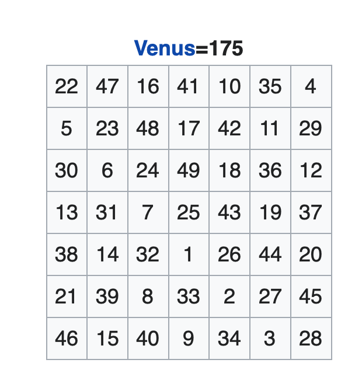

### 1. Magic Squares ( AOC 1.3.2 execise 21 . pages 117)

*A magic square of order n* is an arrangement of the numbers 1 though $$n^2 $$ in square array in such a way that sum of each row and column in $$ n(n^2+1)/2$$, and so is the sum of two main diagonals . Figure 1 shows  a magic sqaure of order 7.

The rules for generating it is easily seen. Start with 1 jumt below the middle square, then go down to the right diagonally - when running off the  edge imagine an entire plane titled  with squares - until reaching a filled square;then drop down two spaces from the most-recently-filled square  and continue .

This method works whenever n is odd.

